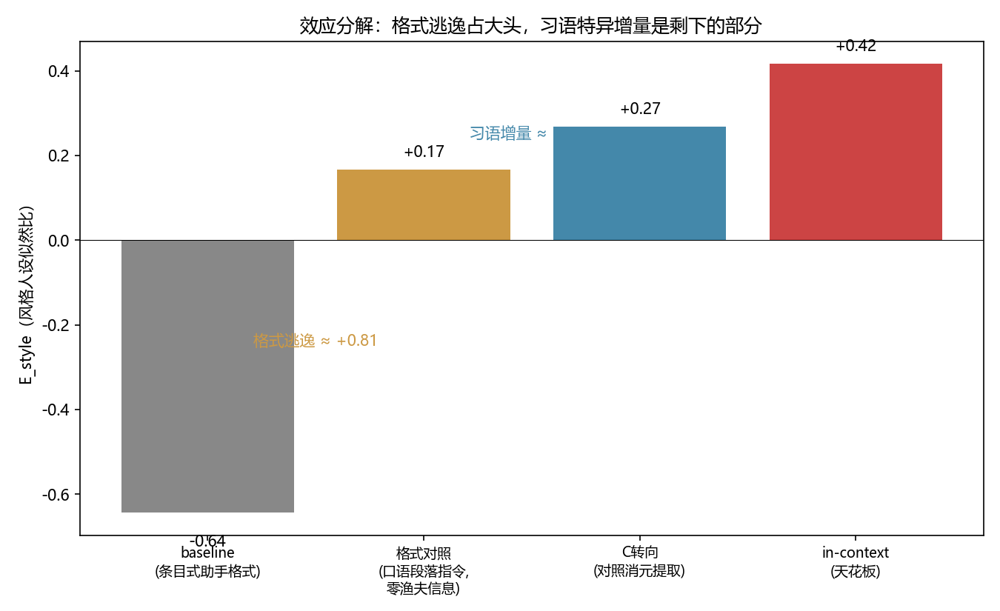
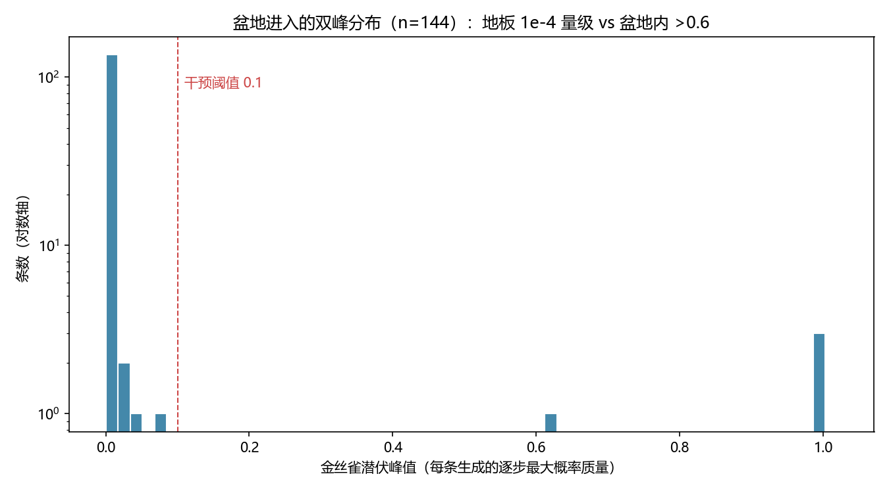
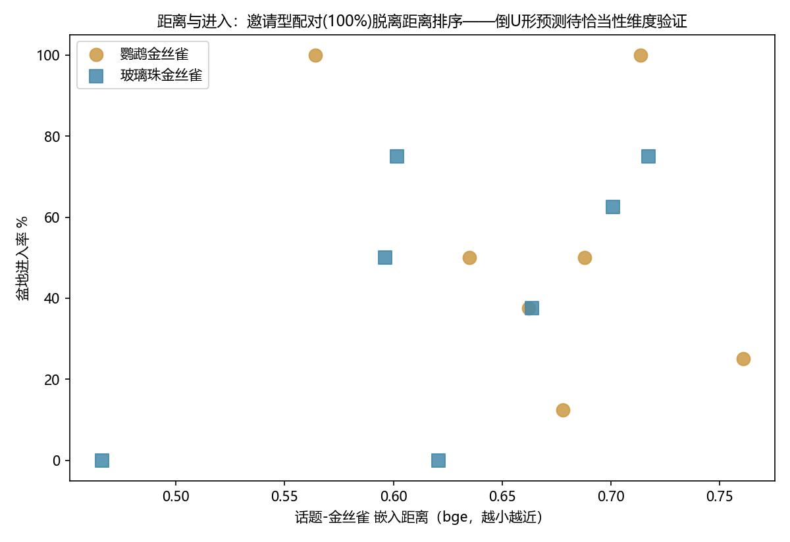
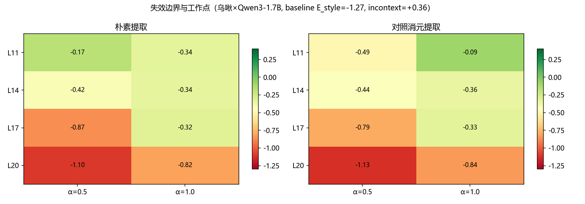
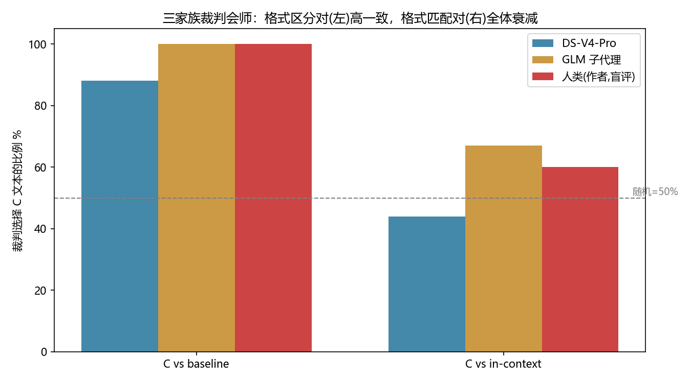
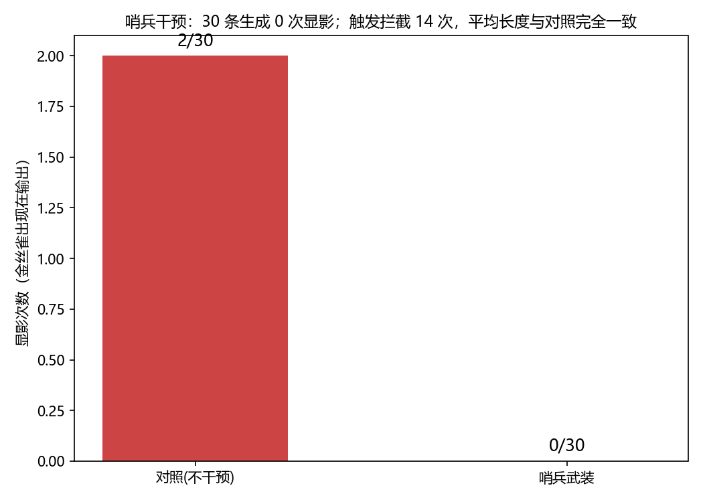

# steer_lab

**示例衍生转向向量的失效边界与突破口** —— 一个在消费级笔记本（RTX 4060 / 8GB）上完成的激活转向研究项目。

English TL;DR: We show that naively-extracted steering vectors from character example sentences **fail** to transfer idiolect style (20 configs, positive control validated), while **same-content contrastive extraction** at the right layer **works** (replicated on 2 models × 2 characters, reaching ~72% of the in-context ceiling with zero content smuggling), alongside a characterization of context pollution as **basin-entry dynamics** with a real-time probability sentinel.

## 核心发现（四条，全部可复现）

| # | 发现 | 关键数字 | 脚本 |
|---|---|---|---|
| 1 | **朴素提取失效 + 消元提取突破**：朴素转向向量跨 20 配置无法转移习语风格；同内容配对消元提取在正确层位可达 in-context 天花板的 72%，零实体走私 | Δ=+1.17 (p=1.5e-12)；格式对照后习语增量 +0.34 (p=0.005) | step6/7/14/16/17 |
| 2 | **阳性对照证明失效非管线问题**：正式度维度同管线双向可移 | 书面标记 1.88→0~0.5 | step8 |
| 3 | **上下文污染 = 盆地进入动力学**：泄漏是双峰事件（中位潜伏 8e-5 vs 盆地内>0.6）；温度只是边缘调制器；哨兵可提前预警（显影事件=潜伏峰值前三） | step9/10 |
| 4 | **距离定律**：话题-金丝雀的模型内部距离预测错境泄漏率（净化后 Spearman −0.73）；高维表征空间高度拥挤（句-句距离 0.02–0.12），信号在带内排名 | step11 |

配套方法学：E 似然比评分器（双人设+第三控制）、金丝雀协议、回弹协议、多家族裁判（DS-V4-Pro + GLM 子代理 + 人类盲评 86% 一致）。

## 核心图表（`python scripts/make_figures.py` 一键从存档数据重生成，无需 GPU）

| 图 | 内容 |
|---|---|
|  | **效应分解**：格式逃逸 ≈ +0.81 vs 习语特异增量 ≈ +0.10 |
|  | **盆地双峰**：泄漏是相变事件（中位 2 步塌陷） |
|  | **距离-进入率**（倒 U 形污染曲线为待验证预测） |
|  | **失效边界与工作点**（朴素 vs 消元，层位×剂量热图） |
|  | **三家族裁判会师**（含格式匹配对的全体衰减） |
|  | **哨兵干预**：0/30 显影，零质量代价 |

## 快速开始

```bash
pip install -r requirements.txt
# 国内自动走 hf-mirror（见 env_setup.py），首次运行自动下载模型
python scripts/step1_extract.py     # 向量提取 + 余弦矩阵（10 分钟内）
python scripts/step2_generate.py    # 四条件生成（可断点续跑）
python scripts/step3_report.py      # 报告
```

核心确认实验：`step14_confirm.py`（预注册双终点）；复现：`step17_replication.py`。
8GB 显存即可（Qwen2.5-3B / Qwen3-1.7B FP16）。实验数据全部在 `results/`。

## 目录

```
configs/       实验配置
data/          角色卡（含游戏台词提取的示例，仅作风格研究，版权归鹰角网络）
scripts/       step1-18 按实验顺序编号
src/           模型hook/提取/注入/度量 库
results/       全部实验数据（jsonl + 向量 + 报告）
docs/          机理手册 / 想法积压 / 论文骨架 / 人类盲评对账
```

## 实验流水线（依赖顺序）

```
阶段A 转向研究:  step1(提取) → step2/2b(生成) → step3(报告)
                 step6(层位扫描) → step7(提取协议v2) → step8(阳性对照)
                 step13(E评分,无需生成) → step14/14b(确认实验) → step17(跨模型复现)
阶段B 污染研究:  step4(回弹) → step5(格式) → step9/9b(金丝雀) → step10(链探针)
                 step11(距离对照) → step19(哨兵干预)
阶段C 评估:      step15/18(裁判,需 DEEPSEEK_API_KEY 见.env.example) → make_figures.py
```
每步的预注册判据、数据文件、判读写在脚本头部注释与 `docs/机理手册.md`。

## 科研诚信声明

- 本项目由人类研究者（问题构想、现象定义、关键混杂发现、素材与盲评）与 AI 助手
  （代码实现、统计分析、文献检索、文稿起草）协作完成，全程对话式推进；
- 全部实验预注册（判据先于运行），阴性结果与三次仪器故障如实报告；
- 人类盲评由作者本人完成（利益冲突已知，独立评分者待补）；
- 占位核查两轮（`docs/占位核查.md`），主张按核查结果两次重定位。

## Roadmap

- [ ] 杀手实验：在 CAST(Llama-2-7B) 协议上量化格式逃逸占比
- [ ] 规模曲线：1.7B/3B/7B 格式逃逸份额
- [ ] 独立人类评分者（去作者冲突）
- [ ] 倒 U 形污染曲线验证（恰当性维度）
- [ ] 门控注意力因果实验（见 docs/想法积压.md）

## 引用

```bibtex
@misc{steer_lab_2026,
  title  = {steer_lab: 示例衍生转向向量的失效边界与突破口},
  author = {SrQingChen},
  year   = {2026},
  url    = {https://github.com/SrQingChen/steer-lab}
}
```

## 引用的游戏素材

乌啾（Ukusik）为《明日方舟》角色，本文引用其 12 句游戏台词（约 300 字）仅作
风格分析研究用途，全部版权归上海鹰角网络所有。

## License

MIT（见 LICENSE）。实验数据与代码可自由用于研究，引用请注明本仓库。
