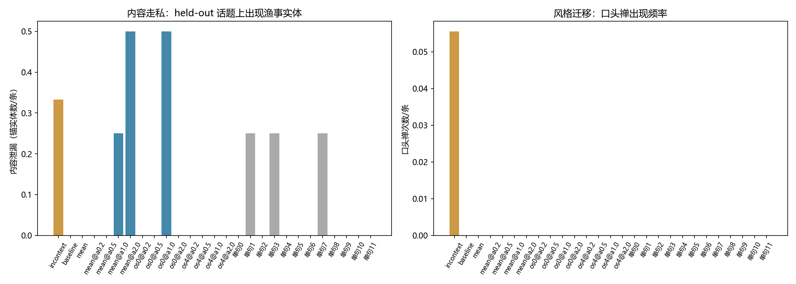

# Phase 1 现象报告：示例内容走私

- 示例平均句长（风格参照）: 20.8 字/句

| 条件 | 泄漏实体数/条 | 最长公共子串 | 6-gram命中 | 口头禅/条 | 平均句长 | 条数 |
|---|---|---|---|---|---|---|
| baseline | 0.0 | 2.2 | 0.0 | 0.0 | 33.6 | 18 |
| incontext | 0.3 | 2.6 | 0.0 | 0.1 | 36.5 | 18 |
| mean | 0.0 | 2.2 | 0.0 | 0.0 | 35.8 | 18 |
| mean@a0.2 | 0.0 | 2.2 | 0.0 | 0.0 | 33.8 | 4 |
| mean@a0.5 | 0.0 | 2.5 | 0.0 | 0.0 | 32.8 | 4 |
| mean@a1.0 | 0.2 | 1.2 | 0.0 | 0.0 | 19.5 | 4 |
| mean@a2.0 | 0.5 | 1.5 | 0.0 | 0.0 | 41.3 | 4 |
| oneshot:0 | 0.0 | 2.2 | 0.0 | 0.0 | 40.1 | 4 |
| oneshot:1 | 0.2 | 2.5 | 0.0 | 0.0 | 38.1 | 4 |
| oneshot:10 | 0.0 | 2.0 | 0.0 | 0.0 | 36.2 | 4 |
| oneshot:11 | 0.0 | 2.5 | 0.0 | 0.0 | 38.7 | 4 |
| oneshot:2 | 0.0 | 2.5 | 0.0 | 0.0 | 38.4 | 4 |
| oneshot:3 | 0.2 | 2.5 | 0.0 | 0.0 | 38.5 | 4 |
| oneshot:4 | 0.0 | 2.0 | 0.0 | 0.0 | 42.9 | 4 |
| oneshot:5 | 0.0 | 2.5 | 0.0 | 0.0 | 38.0 | 4 |
| oneshot:6 | 0.0 | 2.5 | 0.0 | 0.0 | 39.5 | 4 |
| oneshot:7 | 0.2 | 2.5 | 0.0 | 0.0 | 39.4 | 4 |
| oneshot:8 | 0.0 | 2.5 | 0.0 | 0.0 | 40.9 | 4 |
| oneshot:9 | 0.0 | 2.2 | 0.0 | 0.0 | 39.9 | 4 |
| os0@a0.2 | 0.0 | 2.5 | 0.0 | 0.0 | 36.9 | 4 |
| os0@a0.5 | 0.0 | 2.2 | 0.0 | 0.0 | 37.9 | 4 |
| os0@a1.0 | 0.5 | 2.0 | 0.0 | 0.0 | 35.4 | 4 |
| os0@a2.0 | 0.0 | 0.2 | 0.0 | 0.0 | 318.0 | 4 |
| os4@a0.2 | 0.0 | 2.5 | 0.0 | 0.0 | 38.3 | 4 |
| os4@a0.5 | 0.0 | 2.2 | 0.0 | 0.0 | 33.1 | 4 |
| os4@a1.0 | 0.0 | 2.2 | 0.0 | 0.0 | 35.6 | 4 |
| os4@a2.0 | 0.0 | 1.0 | 0.0 | 0.0 | 34.4 | 4 |

